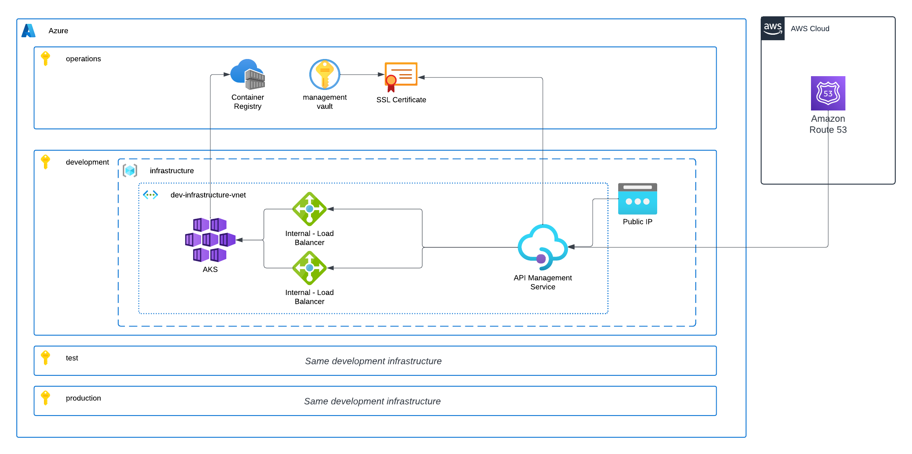

# Full example of Infrastructure and backend deployment

The goal of this project is to demonstrate the development of a full architecture on Azure from the DevOps perspective and development integration, in this case using a .NET backend API as example. 

## Usage

- **https://developers.mateusparente.com**
    - Leveraging the Developer portal feature of API Management service. This is a easy way of having a web page for API documentation reference, for internal and external users.
- **https://apis.mateusparente.com**
    - Hello World example: https://apis.mateusparente.com/todo-api/hello

## Architecture

In this project was used
- Terraform
- AWS
    - Route53. This was already my DNS provider, so wouldn't make sense for me to move it.
- Azure as Cloud Provider
    - Vnet and Network Security Groups
    - AKS
    - Internal Load Balancers
    - Log Analytics Workspace
    - API Management Service
    - Azure Key Vault
    - Azure Container Registry
- SSL certificate
    - Generated using https://letsencrypt.org/

## Prerequisites

- Terraform